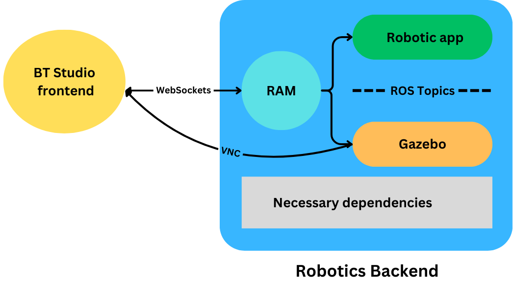
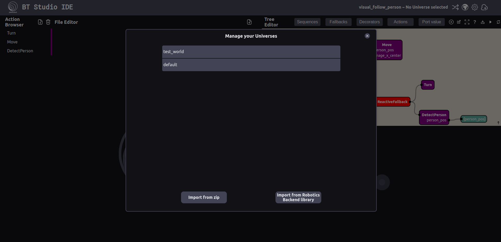

**Note**: Not all changes discussed here are my own contributions; however, I was directly involved in the review process when they were not.

# Summary

This week, we released **BT Studio 0.5**, featuring integration with the Robotics Backend (RB) from JdeRobot. This RB is a Docker container that provides the necessary tools for launching a omplete simulation environment which can be visualized through a browser.

My primary contribution was adding basic support for both the existing Gazebo worlds (referred to as "universes" in RB terminology) and custom ones that users can provide through a zip file. This required changes to the RB, the BT Studio *tree_api* backend, and the web frontend.

# The Robotics Backend

JdeRobot provides a Docker container via DockerHub with a preconfigured environment for running robotics applications, including all necessary dependencies and a websocket API to control every step of the process. At the core of this backend is the [RAM](https://github.com/JdeRobot/RoboticsApplicationManager), a Python script responsible for receiving messages from the browser, launching the necessary components, and managing their lifecycle.

The RAM implements a state machine with four states, representing a progression from connection to running a Gazebo simulation.


To extend RAM's capabilities and allow for launching custom zip universes, modifications were made to the *LaunchUniverse* transition. Let's explore how this works with some code snippets.

First, we need to understand the *LaunchUniverse* message and its fields. How this message is sent from the frontend will be discussed in the frontend section. Essentially, this message is a JSON object referencing a preexisting universe in the RB:

```json
const universe_config = {
  name: stored_cfg.name,
  launch_file_path: stored_cfg.config.launch_file_path,
  ros_version: "ROS2",
  visualization: "gazebo_rae",
  world: "gazebo",
  exercise_id: stored_cfg.config.id,
};
```

Upon receiving this message, the RAM attempts to launch the specified path, which starts a Gazebo server and effectively begins the simulation inside the Docker container. In further steps, visualization is also initiated, allowing the simulation to be viewed through a VNC browser.

Supporting custom zip universes required adding a new field to the JSON called "zip," containing a base64-encoded zip file with all necessary files for launching the custom universe. The manager detects when this field is present and extracts its content into the */workspace/worlds* folder, where all custom universes are stored. The only other change to the message is that the *launch_file_path* field must now be relative to this folder.

### Related PR

https://github.com/JdeRobot/RoboticsApplicationManager/pull/153

# BT Studio Frontend

## The Communication Manager

With RAM now supporting custom universes (simulation environments), it was time to implement communication with the manager from the frontend so that the different steps can be properly activated and the simulation visualized.

To achieve this, a [communication manager](https://github.com/JdeRobot/bt-studio/blob/main/frontend/src/components/comms_manager/CommsManager.js) was developed in JavaScript. This manager handles websocket communication and resolves communication promises. The manager supports the following commands:

```js
const commands = {
  connect: connect,
  launchWorld: (configuration) => send("launch_world", configuration),
  prepareVisualization: (visualization) =>
    send("prepare_visualization", visualization),
  run: (code) => send("run_application", code),
  stop: () => send("stop"),
  pause: () => send("pause"),
  resume: () => send("resume"),
  reset: () => send("reset"),
  terminate_application: () => send("terminate_application"),
  terminate_visualization: () => send("terminate_visualization"),
  terminate_universe: () => send("terminate_universe"),
  disconnect: () => send("disconnect"),
};
```

Using these commands, a step of the RAM can be easily activated from the corresponding part of the frontend (e.g., the start button).

```js
await manager.launchWorld(universe_config);
```

## Launching the Simulation



When the user presses the start simulation button, the frontend sends the [necessary messages](https://github.com/JdeRobot/bt-studio/blob/3557b622212f567251e2ffc2f3b4e560323de2d2/frontend/src/App.js#L74C1-L91C5) to the RAM through the manager, retrieving the configuration from BT Studio's backend. For preexisting universes within the RB, this includes just the launch path and ID; for custom universes, the zip is also needed.

Once this process is complete, the simulation can be visualized through the VNC client integrated into BT Studio, as the RAM will open a server on a predefined port. Using the different commands, the simulation can be stopped, reset, and resumed. I also contributed with small changes to the frontend and its props to support these different interactions.

### Related PR

* https://github.com/JdeRobot/bt-studio/pull/134
* https://github.com/JdeRobot/bt-studio/pull/144

## Universe Modals

Once users select a project, they need a way to launch the desired universe from those available for that project. The universe modal queries the backend for the list and starts the launch process when one of them is selected.



Additionally, I developed a modal for adding custom universes. Users can drag and drop a zip file, and the modal will handle calling the necessary *tree_api* endpoint to store the zip and create its configuration. After that, the user will be able to select it from the list of universes.


### Related PR

* https://github.com/JdeRobot/bt-studio/pull/144
* https://github.com/JdeRobot/bt-studio/pull/149

# BT Studio Backend

Finally, I collaborated on creating new endpoints to:

* Create and retrieve universe information
* Store the zips uploaded by the user in the filesystem

### Related PR

* https://github.com/JdeRobot/bt-studio/pull/144
